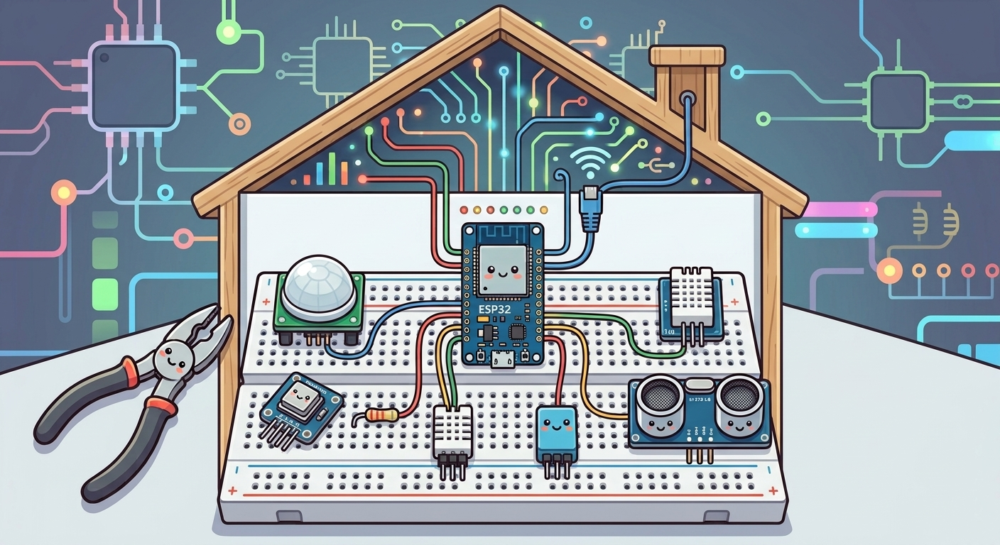

  

⚠️ REPOSITORY - WORK IN PROGRESS ⚠️

  

⚠️ FIRMWARE - WORK IN PROGRESS ⚠️

  

⚠️ HARDWARE - WORK IN PROGRESS ⚠️

  

  <strong>Developed on Raspberry Pi 400 | <s>Hosted on</s> Serverless | Uptime: running since ---</strong>

  

<table align="center" cellspacing="0" cellpadding="0">
  <tr>
    <td>
      
    </td>
    <td>
      
    </td>
  </tr>
</table>

<!-- 
HTML, supabase, github, raspberry, esp32, telegram, dashboard, sql, charts, iot, smarthome-iot, home-automation, supabase-postgresql-integration, raspberry-pi-400-project, domotic, arduino-ide, data-logger, embedded-cpp, iot-dashboard, power-outage-monitoring, security-alarm, smart-home, telegram-bot, esp32-c3, esp32-c3-zero
-->