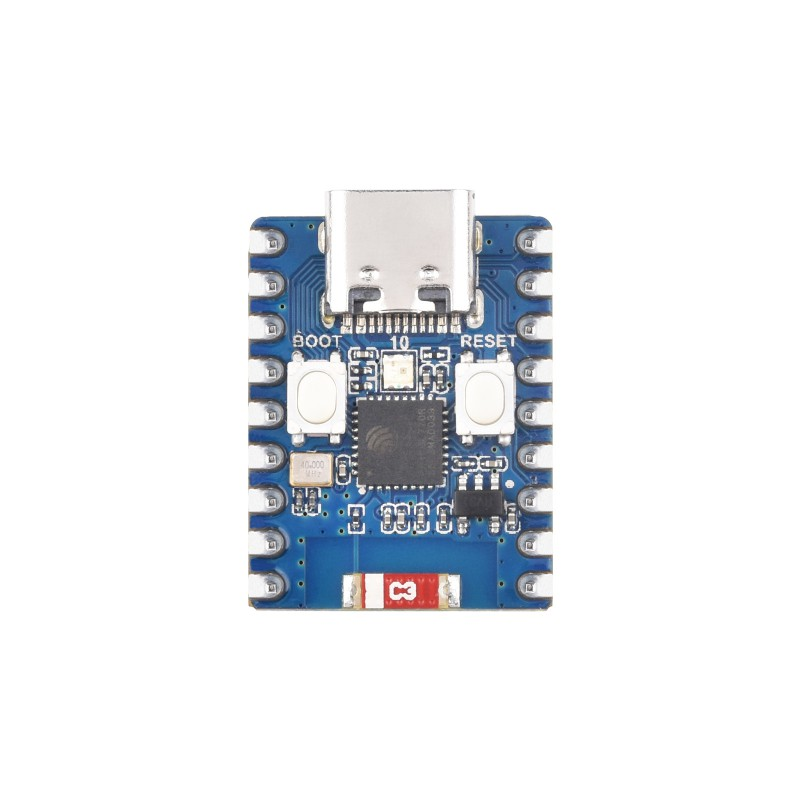
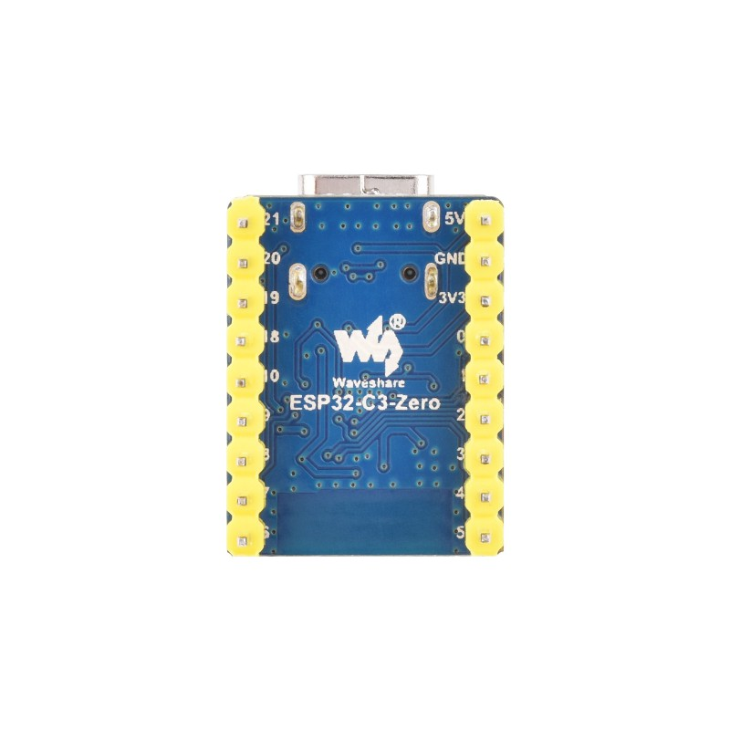
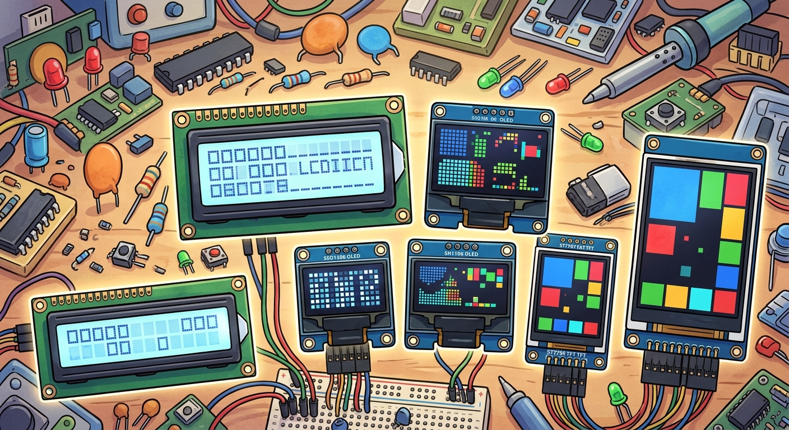
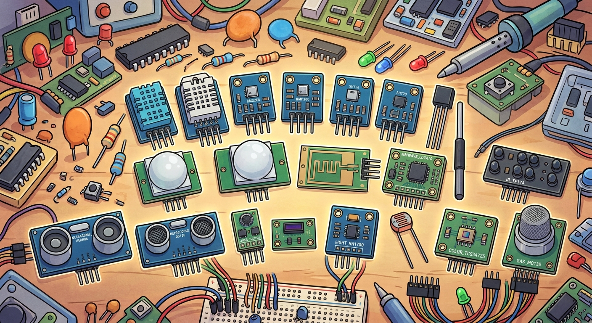

  

Firmware ...

  

Built for the <strong>Waveshare ESP32-C3 MINI</strong>

<table width="100%">
  <!-- ESP32-C3-MINI -->
  <tr>
    <td width="50%" align="center">
      
       <b>front</b>
    </td>
    <td width="50%" align="center">
      
       <b>rear</b>
    </td>
  </tr>
 
</table>

For more information, check the official <strong>Waveshare product page</strong>

  

<strong>DISPLAYS & SENSORS</strong>

✅ Verified & Working &nbsp;&nbsp;|&nbsp;&nbsp; ⌛ Testing in Progress &nbsp;&nbsp;|&nbsp;&nbsp; ❌ Planned / To Test

<table width="100%">
  <!-- DISPLAY / SENSOR -->
  <tr>
    <td width="50%" align="center" valign="top">
      
       <b>display</b>
  
      

        <small><b>LCD</b></small> 
        ✅ LCD_16X2 
        ⌛ LCD_20X4  
        <small><b>OLED</b></small> 
        ❌ OLED_SSD1306 
        ❌ OLED_SH1106  
        <small><b>TFT</b></small> 
        ❌ TFT_ST7789 
        ❌ TFT_ILI9341
      

    </td>
    <td width="50%" align="center" valign="top">
      
       <b>sensor</b>
  
      

        <small><b>CLIMATE</b></small> 
        ✅ DHT11 
        ❌ DHT22 
        ⌛ BME280 
        ❌ BMP280 
        ❌ SHT31 
        ❌ AHT20 
        ❌ DS18B20  
        <small><b>MOTION</b></small> 
        ⌛ PIR_HCSR501 
        ❌ RADAR_RCWL 
        ❌ MMWAVE_LD2410 
        ❌ IR_TE174  
        <small><b>DISTANCE</b></small> 
        ❌ ULTRASONIC_HCSR04 
        ⌛ ULTRASONIC_US100 
        ❌ LASER_VL53L0X  
        <small><b>AMBIENT</b></small> 
        ❌ LIGHT_BH1750 
        ❌ LIGHT_LDR 
        ⌛ COLOR_TCS34725 
        ❌ GAS_MQ135
      

    </td>
  </tr>
</table>

available soon and ready for implementation

  

<table width="100%">
  <!-- XYZ -->
  <tr>
    <td width="50%" align="center" valign="top">
      
       <b>XYZ</b>
    </td>
    <td width="50%" align="center" valign="top">
      
       <b>XYZ</b>
    </td>
  </tr>
 
</table>

  

<table align="center" cellspacing="0" cellpadding="0">
  <tr>
    <td>
      
    </td>
    <td>
      
    </td>
  </tr>
</table>

<!-- 
HTML, supabase, github, raspberry, esp32, telegram, dashboard, sql, charts, iot, smarthome-iot, home-automation, supabase-postgresql-integration, raspberry-pi-400-project, domotic, arduino-ide, data-logger, embedded-cpp, iot-dashboard, power-outage-monitoring, security-alarm, smart-home, telegram-bot, esp32-c3, esp32-c3-zero
-->