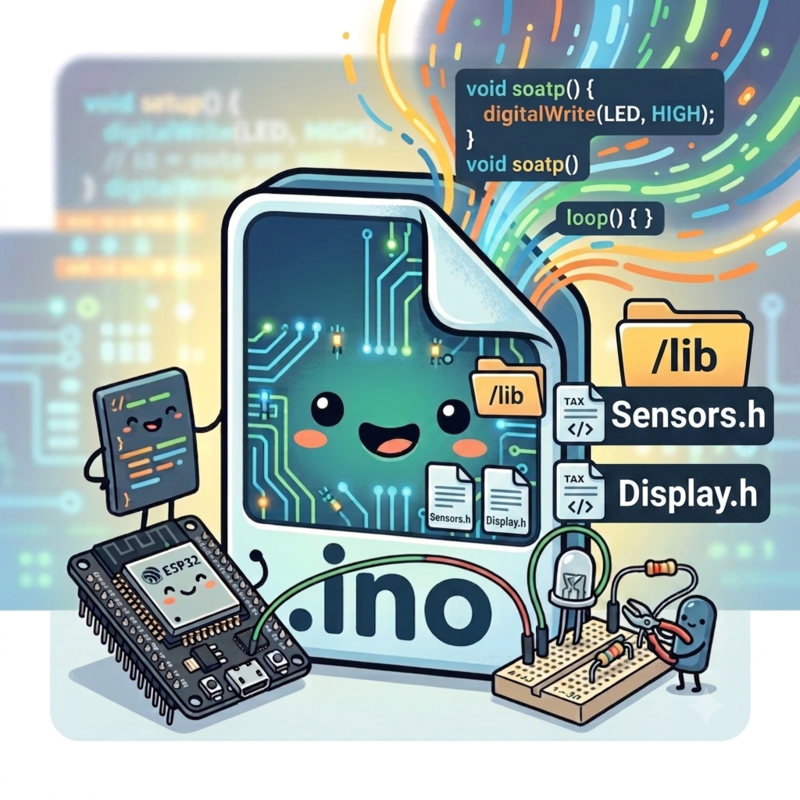
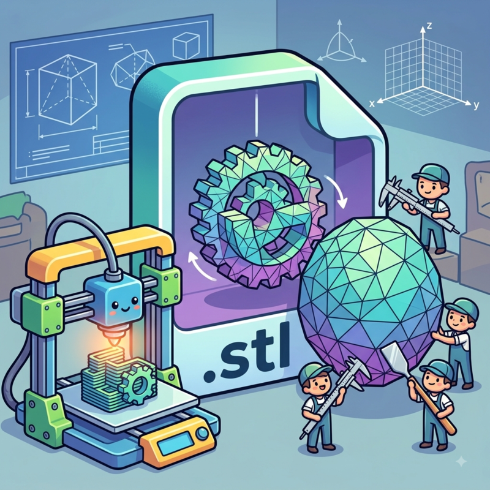

  

Firmware and 3D case for my personal IoT project
  
Built for the <strong>Waveshare ESP32-C3 MINI</strong>

<table width="100%">
  <!-- ESP32-C3-MINI -->
  <tr>
    <td width="50%" align="center">
      
       <b>front</b>
    </td>
    <td width="50%" align="center">
      
       <b>rear</b>
    </td>
  </tr>
 
</table>

For more information, check the official <strong>Waveshare product page</strong>

  

<strong>DISPLAYS & SENSORS</strong>

✅ Verified & Working &nbsp;&nbsp;|&nbsp;&nbsp; ⌛ Testing in Progress &nbsp;&nbsp;|&nbsp;&nbsp; ❌ Planned / To Test

<table width="100%">
  <!-- DISPLAY / SENSOR -->
  <tr>
    <td width="50%" align="center" valign="top">
      
       <b>displays (LCD, OLED, TFT)</b>
  
      

        ✅ LCD_16X2 - Alphanumeric [5V / I2C] 
        ⌛ LCD_20X4 - Alphanumeric [5V / I2C]  
        ❌ SSD1306 - Monochrome OLED 0.96" [3.3V / 5V] 
        ❌ SH1106 - Monochrome OLED 1.3" [3.3V / 5V]  
        ❌ ST7789 - Color TFT [3.3V] 
        ❌ ILI9341 - Color TFT [3.3V]
      

    </td>
    <td width="50%" align="center" valign="top">
      
       <b>sensors</b>
  
      

        <small><b>CLIMATE</b></small> 
        ✅ DHT11 - Temp/Hum [3.3V / 5V] 
        ❌ DHT22 - Temp/Hum [3.3V / 5V] 
        ⌛ BME280 - Temp/Hum/Press [3.3V] 
        ❌ BMP280 - Temp/Press [3.3V] 
        ❌ SHT31 - Temp/Hum [3.3V / 5V] 
        ❌ AHT20 - Temp/Hum [3.3V] 
        ❌ DS18B20 - Temp [3.3V / 5V]  
        <small><b>MOTION & PRESENCE</b></small> 
        ⌛ HCSR501 - Passive Infrared [5V (3.3V signal)] 
        ❌ RCWL - Doppler Microwave [4V - 28V] 
        ❌ LD2410 - Micro-movements [5V] 
        ❌ TE174 - IR Beam [3.3V / 5V]  
        <small><b>DISTANCE</b></small> 
        ❌ HCSR04 - Ultrasound [5V] 
        ⌛ US100 - Ultrasound + Temp [3.3V / 5V] 
        ❌ VL53L0X - Laser ToF [2.8V - 5V]  
        <small><b>AMBIENT</b></small> 
        ❌ BH1750 - Lux (Digital) [3.3V / 5V] 
        ❌ LDR - Analog Photoresistor [3.3V / 5V] 
        ⌛ TCS34725 - RGB + Color Temp [3.3V / 5V] 
        ❌ MQ135 - Air Quality [5V]
      

    </td>
  </tr>
</table>

available soon and ready for implementation

  

  

  

<strong>DOWNLOAD</strong>

<table width="100%">
  <!-- DOWNLOAD  -->
  <tr>
    <td width="50%" align="center" valign="top">
       
      <a href="https://marchino1978.github.io/dom-us/esp32/FIRMWARE.zip" download><strong>Download Firmware (.zip)</strong></a>
       
      <i>Includes: esp32.ino, config.example.h, /lib</i>
       
      <i>N.B.: rename it to: config.h</i>
          </td>
    <td width="50%" align="center" valign="top">
       
      <a href="https://marchino1978.github.io/dom-us/stl/case.stl" download><strong>Download 3D Case (.stl)</strong></a>
       
      <i>3D PRINTED CASE - LEGO TECHNIC STYLE</i>
       
      <i>100% compatible</i>
          </td>
  </tr>
 
</table>

  

<table width="100%">
  <!-- XYZ -->
  <tr>
    <td width="50%" align="center" valign="top">
      
       <b>XYZ</b>
    </td>
    <td width="50%" align="center" valign="top">
      
       <b>XYZ</b>
    </td>
  </tr>
 
</table>

  

<table align="center" cellspacing="0" cellpadding="0">
  <tr>
    <td>
      
    </td>
    <td>
      
    </td>
  </tr>
</table>

<!-- 
HTML, supabase, github, raspberry, esp32, telegram, dashboard, sql, charts, iot, smarthome-iot, home-automation, supabase-postgresql-integration, raspberry-pi-400-project, domotic, arduino-ide, data-logger, embedded-cpp, iot-dashboard, power-outage-monitoring, security-alarm, smart-home, telegram-bot, esp32-c3, esp32-c3-zero
-->