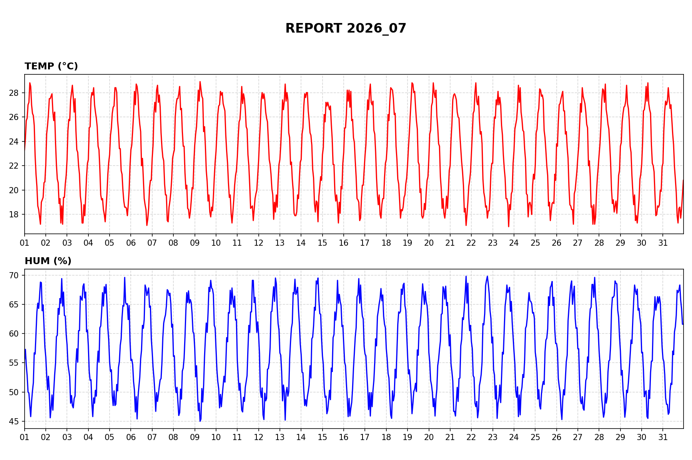
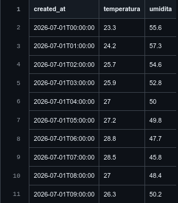
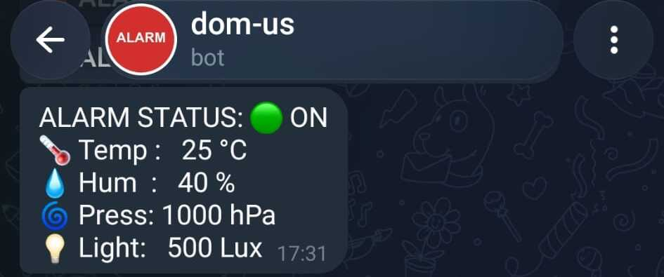
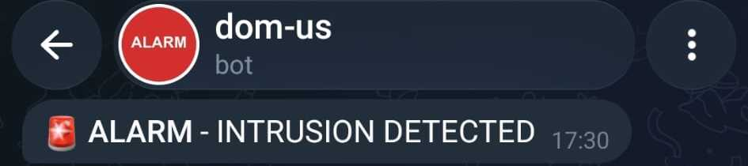
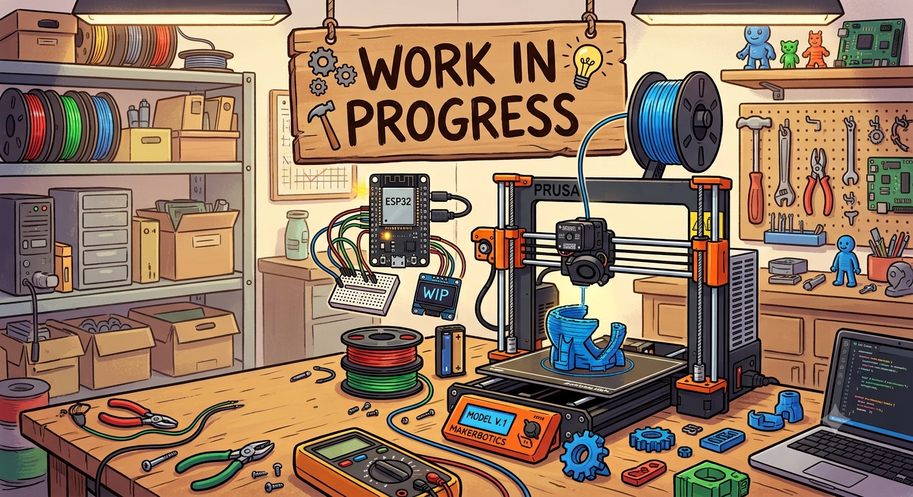

  

<table width="100%">
  <!-- REPORTS -->
  <tr>
    <td width="50%" align="center" valign="top">
       
      <b>monthly report [chart]</b>
    </td>
    <td width="50%" align="center" valign="top">
       
      <b>monthly report [table]</b>
    </td>
  </tr>

  <!-- TELEGRAM MSG -->
  <tr>
    <td width="50%" align="center" valign="top">
       
      <b>STATUS message [TELEGRAM]</b>
    </td>
    <td width="50%" align="center" valign="top">
       
      <b>ALARM message [TELEGRAM]</b>
    </td>
  </tr>

  <!-- LOG -->
  <tr>
    <td width="50%" align="center" valign="top">
       
      <b>alarm LOG [web]</b>
    </td>
    <td width="50%" align="center" valign="top">
       
      <b>alarm LOG [SQL]</b>
    </td>
  </tr>

  <!-- XYZ -->
  <tr>
    <td width="50%" align="center" valign="top">
       
      <b>XYZ</b>
    </td>
    <td width="50%" align="center" valign="top">
       
      <b>XYZ</b>
    </td>
  </tr>

  <!-- XYZ -->
  <tr>
    <td width="50%" align="center" valign="top">
       
      <b>XYZ</b>
    </td>
    <td width="50%" align="center" valign="top">
       
      <b>XYZ</b>
    </td>
  </tr>
</table>

  

<table align="center" cellspacing="0" cellpadding="0">
  <tr>
    <td>
      
    </td>
    <td>
      
    </td>
  </tr>
</table>

<!-- 
HTML, supabase, github, raspberry, esp32, telegram, dashboard, sql, charts, iot, smarthome-iot, home-automation, supabase-postgresql-integration, raspberry-pi-400-project, domotic, arduino-ide, data-logger, embedded-cpp, iot-dashboard, power-outage-monitoring, security-alarm, smart-home, telegram-bot, esp32-c3, esp32-c3-zero
-->